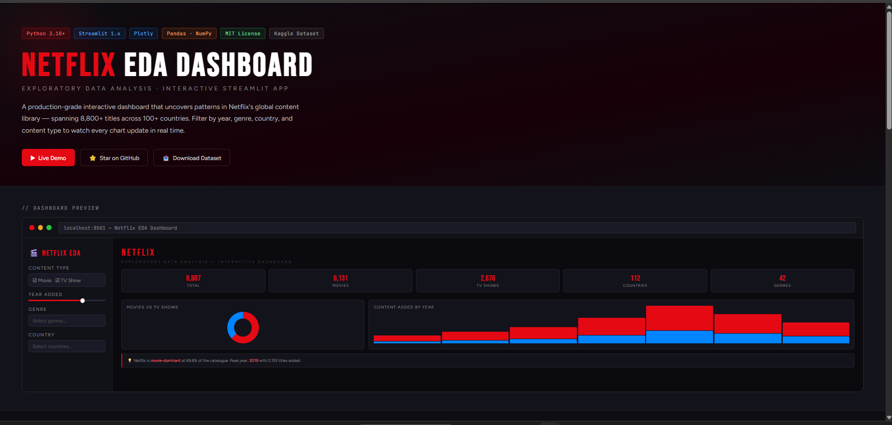
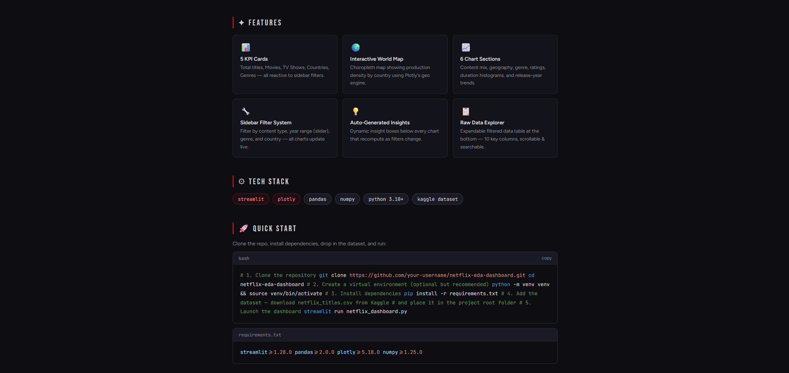
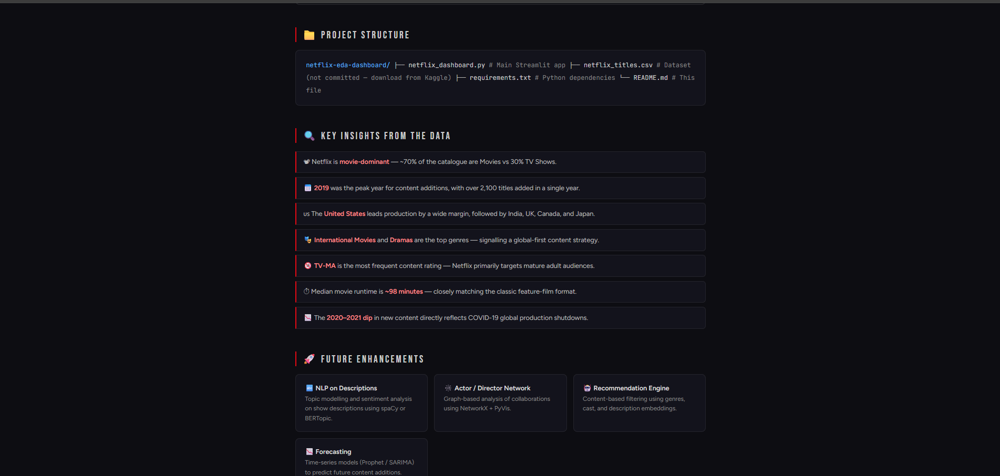
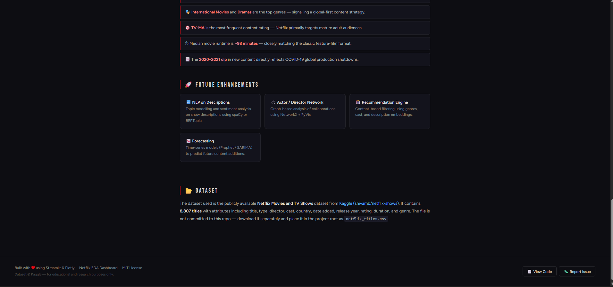

<div align="center">

[](https://python.org)
[](https://streamlit.io)
[](https://plotly.com)
[](https://pandas.pydata.org)
[](LICENSE)
[](https://www.kaggle.com/datasets/shivamb/netflix-shows)

<br/>

# <span>NETFLIX</span> EDA DASHBOARD

**EXPLORATORY DATA ANALYSIS · INTERACTIVE STREAMLIT APP**

<br/>

A production-grade interactive dashboard that uncovers patterns in Netflix's global content library — spanning **8,800+ titles** across **100+ countries**. Filter by year, genre, country, and content type to watch every chart update in real time.

<br/>

[](https://your-demo-link.com)
[](https://github.com/your-username/netflix-eda-dashboard)
[](https://www.kaggle.com/datasets/shivamb/netflix-shows)

</div>

<br/>

---

## `//` DASHBOARD PREVIEW

<br/>

<div align="center">



</div>

<br/>

---

## ✦ FEATURES

<br/>

<div align="center">



</div>

<br/>

<table>
<tr>
<td width="33%" valign="top">

### 📊 5 KPI Cards
Total titles, Movies, TV Shows, Countries, Genres — all reactive to sidebar filters.

</td>
<td width="33%" valign="top">

### 🌍 Interactive World Map
Choropleth map showing production density by country using Plotly's geo engine.

</td>
<td width="33%" valign="top">

### 📈 6 Chart Sections
Content mix, geography, genre, ratings, duration histograms, and release-year trends.

</td>
</tr>
<tr>
<td width="33%" valign="top">

### 🔧 Sidebar Filter System
Filter by content type, year range (slider), genre, and country — all charts update live.

</td>
<td width="33%" valign="top">

### 💡 Auto-Generated Insights
Dynamic insight boxes below every chart that recompute as filters change.

</td>
<td width="33%" valign="top">

### 📋 Raw Data Explorer
Expandable filtered data table at the bottom — 10 key columns, scrollable & searchable.

</td>
</tr>
</table>

<br/>

---

## ⚙ TECH STACK

<br/>

[](https://streamlit.io)
[](https://plotly.com)
[](https://pandas.pydata.org)
[](https://numpy.org)
[](https://python.org)
[](https://kaggle.com)

<br/>

---

## 🚀 QUICK START

Clone the repo, install dependencies, drop in the dataset, and run:

```bash
# 1. Clone the repository
git clone https://github.com/your-username/netflix-eda-dashboard.git
cd netflix-eda-dashboard

# 2. Create a virtual environment (optional but recommended)
python -m venv venv && source venv/bin/activate

# 3. Install dependencies
pip install -r requirements.txt

# 4. Add the dataset — download netflix_titles.csv from Kaggle
#    and place it in the project root folder

# 5. Launch the dashboard
streamlit run netflix_dashboard.py
```

```
# requirements.txt
streamlit>=1.28.0
pandas>=2.0.0
plotly>=5.18.0
numpy>=1.25.0
```

<br/>

---

## 📁 PROJECT STRUCTURE

```
netflix-eda-dashboard/
├── assets/
│   ├── screenshot1.png         # Dashboard hero & KPI preview
│   ├── screenshot2.png         # Features, tech stack & quick start
│   ├── screenshot3.png         # Project structure & key insights
│   └── screenshot4.png         # Future enhancements & dataset
├── netflix_dashboard.py        # Main Streamlit app
├── netflix_titles.csv          # Dataset (not committed — download from Kaggle)
├── requirements.txt            # Python dependencies
└── README.md                   # This file
```

<br/>

---

## 🔍 KEY INSIGHTS FROM THE DATA

<br/>

<div align="center">



</div>

<br/>

> 📽 Netflix is **movie-dominant** — ~70% of the catalogue are Movies vs 30% TV Shows.

> 📅 **2019** was the peak year for content additions, with over **2,100 titles** added in a single year.

> 🇺🇸 The **United States** leads production by a wide margin, followed by India, UK, Canada, and Japan.

> 🎭 **International Movies** and **Dramas** are the top genres — signalling a global-first content strategy.

> 🔞 **TV-MA** is the most frequent content rating — Netflix primarily targets mature adult audiences.

> ⏱ Median movie runtime is **~98 minutes** — closely matching the classic feature-film format.

> 📉 The **2020–2021 dip** in new content directly reflects COVID-19 global production shutdowns.

<br/>

---

## 🚀 FUTURE ENHANCEMENTS

<br/>

<div align="center">



</div>

<br/>

<table>
<tr>
<td width="33%" valign="top">

### 🔤 NLP on Descriptions
Topic modelling and sentiment analysis on show descriptions using spaCy or BERTopic.

</td>
<td width="33%" valign="top">

### 🕸️ Actor / Director Network
Graph-based analysis of collaborations using NetworkX + PyVis.

</td>
<td width="33%" valign="top">

### 🤖 Recommendation Engine
Content-based filtering using genres, cast, and description embeddings.

</td>
</tr>
<tr>
<td width="33%" valign="top">

### 📉 Forecasting
Time-series models (Prophet / SARIMA) to predict future content additions.

</td>
<td width="33%" valign="top"></td>
<td width="33%" valign="top"></td>
</tr>
</table>

<br/>

---

## 📂 DATASET

The dataset used is the publicly available **Netflix Movies and TV Shows** dataset from [Kaggle (shivamb/netflix-shows)](https://www.kaggle.com/datasets/shivamb/netflix-shows). It contains **8,807 titles** with attributes including title, type, director, cast, country, date added, release year, rating, duration, and genre.

> ⚠️ The file is **not committed** to this repo — download it separately and place it in the project root as `netflix_titles.csv`.

<br/>

---

<div align="center">

Built with ❤️ using **Streamlit** & **Plotly** &nbsp;·&nbsp; Netflix EDA Dashboard &nbsp;·&nbsp; MIT License

<sub>Dataset © Kaggle — for educational and research purposes only.</sub>

<br/>

[](https://github.com/your-username/netflix-eda-dashboard)
[](https://github.com/your-username/netflix-eda-dashboard/issues)

</div>
